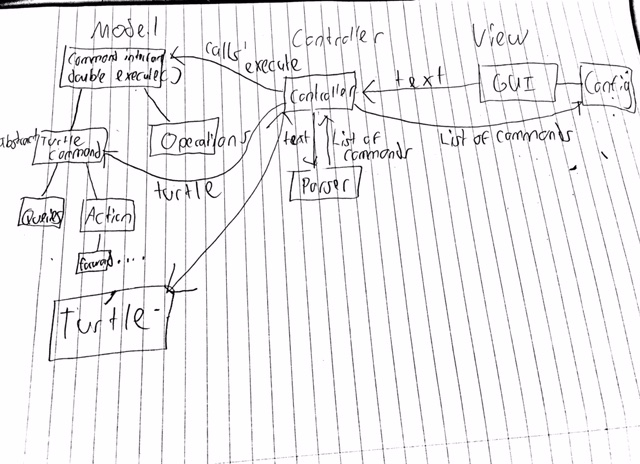
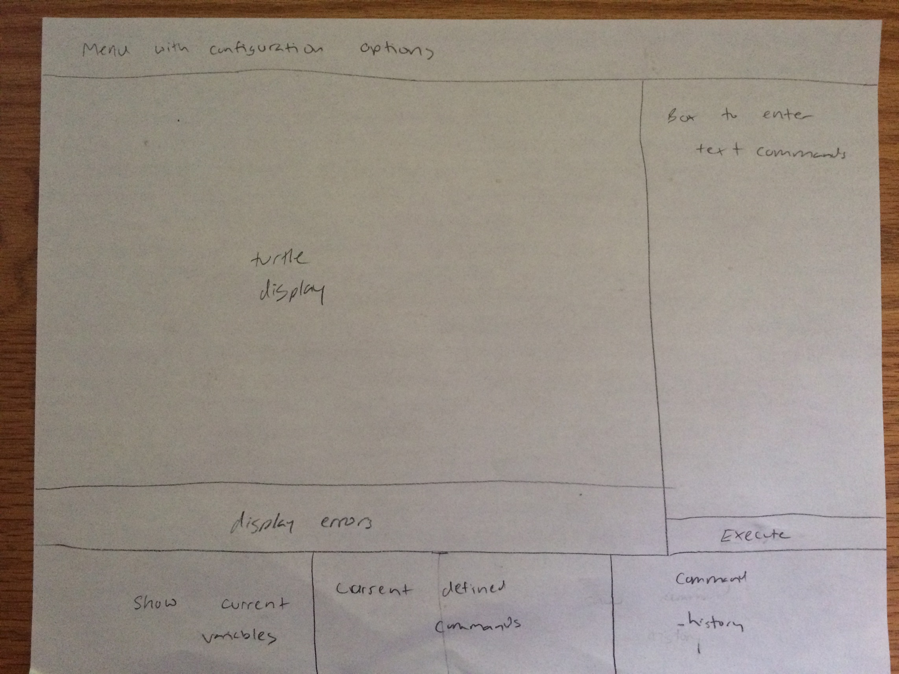

SLogo Design
============
> This is the link to the Design Assignment
 [DESIGN](http://www.cs.duke.edu/courses/compsci308/spring16/assign/03_slogo/part1.php)

People
------

* Rhondu Smithwick- rss44
* Stephen Kwok - smk44
* Cali Nelson - can18
* Jonathan Ma - dm269

Introduction
-------------

The goal of this project is to closely integrate frontend and backend APIs, allowing
different teams to easily communicate to reach a common goal. There must be
flexibility in terms of how the turtle executes its commands, and it must be easy for
the frontend and backend to communicate changes to the turtle. The frontend will be
closed to the backend, only passing a turtle object to the backend. The backend will
open up only a facilitator class to the frontend. All of its other classes will be closed.

Design Overview
----------------

* The project is divided up between the View (frontend) and the Model (backend).
* The View (see User Interface section) will be focused on a Turtle class and a
GUI class.
  * The Turtle class will be our class for holding the information specifically relating to a turtle
  IE setPenColor, setFill, etc... It is noted that the turtle is passed to the backend, which will run the user input
command on the turtle.
  * The GUI will contain the actual user interface and will allow the user to input text.
* The View will pass the inputted text to a Controller class that implements the Control interface.
* The Model (see Design Consideration Section for more discussion on this) will be focused around the
Command interface. For example, the interface contains a single method execute() that is common throughout all commands.
* These are the steps to the the View and Model's interaction.
1. The user inputs text, which the View saves and passes to the backend.
2. The Model parses the text, creates a List of commands based on it, and gives this
list of commands back to the View.
3. Finally, the View executes this list of commands. It will also display their return value on the GUI as required.




User Interface
---------------

* The user will enter commands into a text box in the userinterface.  They can enter multiple commands at once, until they press the execute button which will execute the entered commands. The user can continue to enter commands and press execute until they are finished.  The results of the turtle commands will be shown in the middle of the screen. At the top will be a menu bar with various buttons and combo boxes that allow the user to change different stylistic things about the simulation, including choosing a turtle image, chosing colors, and accessing a help document. There will be another area to display the result of any errors or exceptions; how exactly these errors will be displayed is not yet set.  Finally there will be an area below the turtle display that will show any currently defined user commands, any currently defined variables, and the past execution history for the simulation.





API Details
-----------

* The Model is focused on this interface
```java
public interface Command {

  /**
    * Do this command.
  **/
  double execute();

}
```
which allows the Controller to execute on its list of commands.
* It facilitates with the front end with
```java
public interface Controller {

  /**
    Accept an input string.
  **/
  void takeInput(String input);

  /**
    * Get a list of all commands.
  **/
  List<Command> getCommands();
}
```

### View API Details
* The View or FrontEnds external API is intended to be used so that the Backend can pass information to the front end that needs to be displayed to the user, such as Error Messages when the User has made a syntax error or entered a command incorrectly.  It also ensures that every view will always have a passInput method whose job is to pass entered commands to the controller or model once the user has pressed the execute button. In this case the interface acts as a contract to ensure that the view contains this method. The external API can be extended to allow the backend to pass more information to be displayed if necessary. It could also be extended so that the backend can fetch needed information that may be kept by the front end.
* The Views internal APIs are designed to hold certain elements to a contract that they must fulfill, so that other classes can depend upon them, yet also allow these classes to be extended to include new features.  The toolbar interface is an internal API for the menu at the top of the UI which includes all configuration and styling options for the user. This is extendable as it allows a new toolbar to be easily defined as long as it follows the contract of its interface. The toolbar class will take care of setting up and creating event handlers for all menu options, which are many of the features of the project.  There is also a turtleDisplay internal API that creates a contract for any turtle display area. The underlying object in the display area can be any node object, which allows a lot of extendability, but the interface ensures that the background can be stylized and that the node can be accessed. The turtle display will contain the node underlying the turtle display area and manage any stylizing and configuration of the area. This allows the turtle area to be extendable particularly style wise while still ensuring it will fit with the rest of the view.  The command history interface provides a contract for any class implementing the command history feature of the project.  It ensures that any class implementing it will have methods to add commands as well as get the graphical node showing the commands and the string array storing the commands. This could be extended to perhaps save the current command history into a .logo file, or in accordance with the Error Display, to allow any errors to highlight the line of the command history the error occurred on. The environment display interface provides a framework for any class to display the currently defined variables and methods. It ensures that this node can be accessed by the view and it ensures that this display can be updated to reflect the models current state. It allows these displays to have extendable functionality so long as they follow the contract laid out by the interface. It implements the features of displaying any currently set variables and methods. The Command Entry interface implements the feature allowing the user to enter text commands. The interface ensures that any class implementing this feature has methods allowing the node used to implement it to be accessed as well as commands to get text entered and to clear any text that is entered. This represents the basic functionality needed for this component and the interface could be extended to add additional features if needed. One possible extension is to allow a user to load a .logo file instead of inputting commands manually. This interface could be extended to allow that to be possible as the only new method that would need to be added to the interface would be one load the strings contained in the file into the Command Entry datastructure.  The Error Display interface provides a framework to implement the feature to display errors to users. It ensures that any possible error display class will be able to take in an error message and display it as well as clear the error display. It could be extended in the future to possibly keep a history of the errors or perhaps to highlight what line of the command history the error occurred on.
* I created each different component of the User Interface as its own interface and its own object as I believe this gives the View the greatest flexability and extendability.  If all the different nodes and boxes were coded just into a main view class it would be very hard to extend each of them to allow new features.  This way each of the boxes, from the tool bar, to the history box, to the error display can be abstracted or extended to easily add new features without rewriting a large amount of the View code, and by just adding a new subclass or extending the interface. Seperating all the components out into different classes should make it easier to add new features to each component without worrying about how they affect another component or the View as a whole, as they should work so long as they fulfill the contract stipulated by the interface they implement.

API Example code
-----------------

* Suppose the user inputs fd 50.
* In GUI:
```java
  myController.takeInput("fd 50")  // would actually be variable
```
* In Controller:
```java
  List<Command> myCommands = parse("fd 50");
  // assuming the parse works correctly
  myCommands.stream().forEach(Command::execute);
```
* Now for an actual command
```java
public class Forward extends TurtleCommand {

  private final double distance;

  public Forward(Turtle myTurtle, double distance) {
    super(myTurtle);
    this.distance = distance;
  }

  public double execute() {
    Point2D directionVector = getDirectionVector();
    double newX = getTurtle().getX() + (distance * unitDirVector.getX());
    double newY = getTurtle().getY() + (distance * unitDirVector.getY());
    // have turtle move to (newX, newY) drawing a line
    // in the process if its pen is down
    getTurtle().moveTo(newX, newY);
    return distance;
  }

  private Point2D getDirectionVector() {
    // getHeading returns the Point on the edge of the screen the turtle is currently facing
    Point2D heading = getTurtle().getHeading();
    double dirVectorX = heading.getX() - getTurtle().getX();
    double dirVectorY = heading.getY() - getTurtle().getY();
    double dirVectorDistance = Math.sqrt(dirVectorX * dirVectorX + dirVectorY * dirVectorY);
    return new Point2D (dirVectorX / dirVectorDistance, dirVectorY / dirVectorDistance);
  }
}
```

* Use Case - Cali Nelson: If entered command threw an error
```java

	User clicks execute button
	String[] commands = CommandEntryInterface.getCommands;
	CommandEntryInterface.clear();
	ViewInt.passInput(commands);
	//for each command in commands
		CommHistoryInterface.addCommand(command);
	myController.takeInput(commands);
	List<Command> myCommands = parse(commands);
	myCommands.stream().forEach(Command::execute);
	EnvironmentDisplayInterface.updateEnvNode();
	//backend detects an error
	ViewInt.passError(errorString);
	ErrorDisplayInterface.showError(errorString);
```

Design Considerations
----------------------

###Interface vs Abstract Class

> Our primary discussion for backend design was centered around how our code could most efficiently reflect the commands that the SLogo IDE takes in.
  We had two main ideas as two how we could do this:

> - Have an abstract class called **Command** that contains global variables like **double degrees** and **double distance**, along with an abstract
    method called **execute** that would execute the command on the Turtle. We would then make each unique command as a subclass of the **Command**
    class. For instance, **Command** would look something like this:

```java
public abstract Class Command {
  private double degrees;
  private double distance;
  private Turtle turtle;

  public Command(Turtle turtle, double distance, double degrees) {
    super(turtle, distance, degrees);
  }

  public void execute(Turtle turtle) {
    //insert some code
  }
}
```

> - Have an interface called **Command** that would currently only have execute as the sole method in the interface. Then, each class that implements
    the interface would need to have an execute method. Additionally, each class would have to have its own "special" global variables. For example,
    the **Forward** class would have the global variable of **double distance**, but not **double degrees**, while the **Right** class would have
    **double degrees**, but not **double distance**.

> Pros and Cons

> - One of the pros of using a single abstract class would be code consolidation. There would be less code to worry about for each subclass, since most
    of the work could be handled in the super class. This could potentially mean easier code management and cleaner looking code.
> - However, one the major cons of using a single abstract class is the fact that a lot of the subclasses wouldn't utilize the variables in the Abstract
    class at all. For instance, the **Forward** class doesn't care about the **degrees** variable at all and the **Right** class wouldn't care about the
    **distance** variable at all either. This seems like a big waste of code.
> - One of the pros of using the interface is that it would help with API design, since all of our primary methods would be held within that interface.
    Additionally, it is extremely useful for code management and we can easily create new classes from an interface when necessary. It also takes care of
    the need to specialize the different command classes, since each command class will have it's own unique global variables. This way, we won't have
    the **Forward** class with a **degrees** variable when it doesn't really need one.
> - The main con against using an interface is that currently, the only method in the interface is **execute()**, so it seems like the interface doesn't
    really do much. But, our team does believe that the interface gives us more options for future extension and makes the overall code more flexible.
    More than likely, there will be more methods added to the interface by the end of the project.

###Parsing of User Input

> One of the other important design considerations that the team really discussed was where the parsing of user input would take place. There were two
  options, each with their own reasons:

> - We could place the parsing in the backend, which is where parsing would normally seem to take place.
> - We could place the parsing in the frontend, which would make more sense, as the backend could just process parsed data to make the next move.

> Backend Parsing

> - There doesn't really seem to be a major pro for placing the parsing specifically in the backend. One interesting point that was brought up was that
    backend parsing would require the frontend to just pass the user inputted string to the backend and then have the backend handle all of the data.
    This would keep the user inputted data all in one place and it would be easy to keep track of it.
> - The main con against backend parsing was that it would add another section of functionality to an already heavy workload for the backend coders. It
    also seemed to potentially make the frontend significantly easier.

> Frontend Parsing

> - The pro for frontend parsing was that it would make the backend code less dense and seemingly help split up the work more evenly among the team. It
    also seemed to make more sense for the frontend to grab the user input and immediately parse the input and pass that data to the backend.
> - The con against this is that it seems conventionally, an action like parsing should be handled in backend. It would also split up the data handling
    between two groups, which may complicate things.

Team Responsibilities
----------------------

Back-end: Rhondu and Jonathon will be responsible for implementing the back-end components of this project. This will include creating the command classes that update various attributes of the Turtle such as its current position or current direction.

Front-end: Stephen and Cali will be responsible for implementing the front-end components of this project. This will primarily involve creating the various features of the GUI that will serve as the user interface. Features of the GUI will include a display for showing the Turtle, a menu with configuration options, a command box for enterting text commands, and a command history box.
